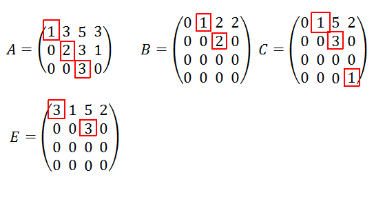
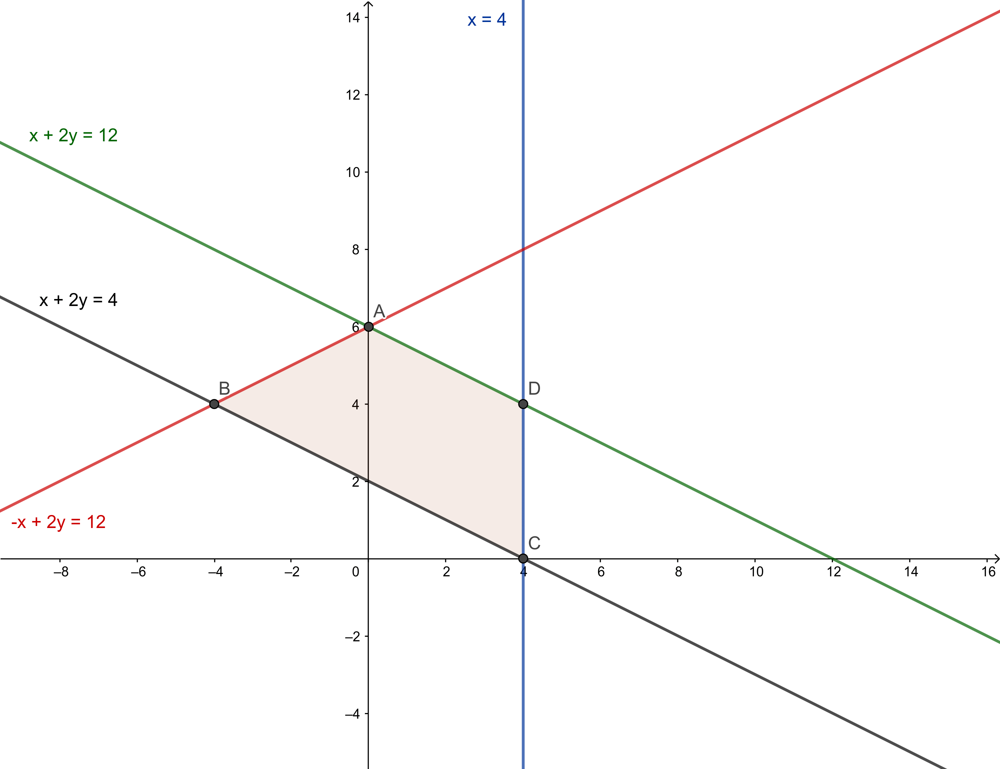

# Álgebra

## Rango de una matriz

Se define el **rango** de una matriz como el máximo número de columnas o filas linealmente independientes de la matriz. Si tenemos una matriz $A$ de dimensiones $n\times m$, entonces el rango de dicha matriz es como máximo el valor mínimo entre $n$ y $m$. Es decir, en una matriz $2\times 3$, el rango no puede ser mayor que 2.

Para calcular el rango de una matriz, podemos usar o bien el método de Gauss, o bien determinantes.

### Usando el método de Gauss

En una matriz escalonada, que es la que se obtiene al terminar de aplicar el método de Gauss sobre una matriz, los pivotes son aquellos elementos que son distinto de cero y además tienen por debajo todos los elementos cero. Ej: 

### Usando determinantes

Además de con el método de Gauss, podemos usar determinantes para calcular el rango de la matriz (aunque la matriz no sea cuadrada). El rango de la matriz coincidirá con el tamaño del mayor determinante no nulo que podamos encontrar dentro de la matriz. El problema principal de este método es que requiere de probar todas las posibles combinaciones de determinantes para poder asegurar el valor del rango de la matriz.

## Teorema de Rouché-Frobenius

El teorema de Rouché, o teormea de Rouché-Frobenius nos da qué casos se pueden dar en un sistema de ecuaciones, y cómo identificar cada caso. Supongamos que tenemos un sistema de ecuaciones de la forma $Ax = b$, que puede expresarse como $\left( A \; \vert \; b \right)$, donde a $A$ la llamamos **matriz de coeficientes** y a $\left( A \; \vert \; b \right)$ la llamamos **matriz ampliada** del sistema de ecuaciones. Pues bien:

* Si $rg(A) = rg \left( A \; \vert \; b \right) =$ nº de incógnitas del sistema ($x,y,z...$), el sistema tiene una **única solución**. Se dice entonces que el sistema es **compatible determinado**. 
* Si $rg(A) = rg \left( A \; \vert \; b \right) <$ nº de incógnitas del sistema ($x,y,z...$), el sistema tiene **infinitas soluciones**. Se dice entonces que el sistema es **compatible indeterminado**. Esta situación la podemos observar cuando al aplicar el método de Gauss sobre el sistema de ecuaciones, nos queda una fila de ceros en la matriz ampliada.
* Si $rg(A) \neq rg \left( A \; \vert \; b \right)$, el sistema **no tiene solución**. Se dice entonces que el sistema es **incompatible**. Esta situación la podemos observar cuando al aplicar el método de Gauss sobre el sistema de ecuaciones, nos queda una ecuación de la forma $0 = 1$.

## Regla de Cramer

Cuando un sistema $\left( A \; \vert \; b \right)$ tiene una única solución (compatible determinado), es decir, $\vert A \vert \neq 0$, las soluciones de dicho sistema son de la siguiente forma:

* Si $A = \left( a_1 \, a_2\, a_3 \right)$, siendo $a_1 \, a_2\, a_3$ las columnas de $A$, entonces:

\begin{gather*}

x = \frac{\vert \left( b \, a_2 \, a_3\right) \vert}{\vert A \vert} \\\\
y = \frac{\vert \left( a_1 \, b \; a_3\right) \vert}{\vert A \vert} \\\\
z = \frac{\vert \left( a_1 \, a_2 \; b\right) \vert}{\vert A \vert}

\end{gather*}

En general la regla de Cramer nos conviene aplicarla cuando en la matriz $A$ aparezca algún parámetro ($m, k, ...$).

## Método de Gauss

El método de Gauss nos permite calcular siempre las soluciones de un sistema de ecuaciones, independientemente de si el sistema es compatible determinado, compatible indeterminado o incompatible. Las operaciones que se pueden realizar en este método son:

* Sumar (o restar) dos filas. Esta operación no tiene ningún impacto sobre el determinante de la matriz.
* Multiplicar una fila por un número distinto de cero. Esta operación nos multiplicará el determinante por dicho número.
* Intercambiar filas de orden. Esta operación cambia el signo del determinante.

El propio método de Gauss hemos de aplicarlo siempre de forma escalonada, de manera que:

1. En el elemento en la posicion $(1,1)$ intentamos situar un número distinto de cero. Si no lo hay al principio intercambiaremos filas de orden hasta que lo haya.
2. A través de las operaciones del método de Gauss, hacemos ceros sobre los números que estén situados por debajo del $(1,1)$.
3. Continuamos con el elemento siguiente en la diagonal principal.

Es importante saber qué impacto tienen las operaciones del método de Gauss sobre el determinante de una matriz porque en ciertas ocasiones es más sencillo calcular el determinante haciendo pocas operaciones de Gauss que de otra manera.

## Inversa de una matriz

Únicamente tendrán inversa, denotada por $A^{-1}$ aquellas matrices que sean cuadradas y además su determinante no sea nulo. La matriz inversa es aquella que cumple que $A^{-1}A = AA^{-1} = I$. Para calcular la inversa de una matriz disponemos de dos métodos:

### A través del método de Gauss-Jordan

El método de Gauss simple acaba una vez hayamos recorrido todos los elementos de la diagonal y hecho ceros por debajo de estos. No obstante, existe un método que extiende al anterior conocido como método de Gauss-Jordan en el cuál además de hacer ceros por debajo de la diagonal, haremos ceros también por encima, y una vez únicamente tengamos la diagonal, dividiremos cada fila por el elemento de la diagonal de esa fila.

Así pues, el cálculo de la inversa se reduce a aplicar Gauss-Jordan sobre el siguiente sistema:

$$ \left( A \, \vert \,  I\right) \stackrel{G-J}{\longrightarrow} \left( I \, \vert \,  A^{-1}\right) $$

Donde $I$ denota la matriz identidad.

### A través de la matriz adjunta

Dada una matriz $A$, se define su **matriz adjunta** como aquella donde sustituimos cada elemento de la matriz por su adjunto, definido de la siguiente manera:

Si $A = (a_{ij})$, entonces para cada elemento $a_{ij}$ de la matriz definimos su adjunto como $(-1)^{i+j}\cdot \vert A_{ij} \vert$, donde $A_{ij}$ denota la matriz resultante de eliminar la fila $i$ y la columna $j$ de la matriz $A$.

Así pues, la inversa de una matriz se puede calcular como $A^{-1} = \frac{(A^{adj})^t}{\vert A \vert}$

## Programación lineal

En esta última sección, el objetivo es aprender a encontrar máximos y mínimos sobre una **función objetivo** en una región delimitada. Dicha región, vendrá dada por una serie de **inecuaciones**,que son simplemente ecuaciones donde en lugar de tener un signo de $=$ tendremos desigualdades del tipo $\leq$.

* En primer lugar, trazaremos las rectas que cada inecuación representa.
* Una vez trazadas dichas rectas, plantearemos una serie de sistemas de ecuaciones, eligiendo las ecuaciones dos a dos para hallar los puntos de corte de cada par de rectas.
* Por último, evaluamos la función objetivo en los puntos de corte. El máximo (y el mínimo) se tendrá siempre en uno de estos puntos.

### Un ejemplo práctico

Considérese la región del plano definida de la siguiente forma:

$$ S = \{(x,y) \in \mathbb{R}^2 : x+2y \geq 4; x+2y \leq 12; x \leq 4; -x+2y \leq 12 \}$$

En primer lugar, planteamos las ecuaciones, y damos valores para trazar las rectas:

$$\begin{gather}
x+2y = 4\\
x+2y = 12\\ 
x = 4\\
-x+2y =12 
\end{gather}$$

Una vez dibujada cada una de las rectas, deberemos dar un punto dentro de la inecuación para saber a qué región del plano delimita la inecuación. Es importante que el punto **no** esté en la recta. Por ejemplo, para la inecuación $x+2y \geq 4$ sabemos que si sustituimos por ejemplo el punto $(0,0)$, tenemos que $0+2\times 0 = 0$ que no es menor que $4$, por tanto la mitad a la que delimita esta inecuación es la superior. Cuando hayamos hecho eso con todas, podremos delimitar la región $S$, como se muestra a continuación.

Para encontrar los puntos de corte del recinto, tendremos que plantear los sistemas de ecuaciones dos a dos. Por ejemplo, para calcular el punto $D$, tendríamos que plantear el siguiente sistema:

$$\begin{cases}
x+2y=12 \\
x = 4
\end{cases}
$$

Que puede resolverse directamente por sustitución y nos daría el punto $D = (4,4)$. Una vez calculados el resto de vértices, si nos dan una función objetivo como por ejemplo $f(x,y) = 3x-y$, y nos piden que demos el valor máximo (o mínimo) que alcanza esa función en el recinto $S$, únicamente tendremos que calcular el valor de $f$ en $A, B, C$ y $D$ y ver los valores que obtenemos para cada punto.

# Análisis

## Límites y continuidad

El concepto de límite matemático suele ser un tema que, en el mejor de los casos, causa cierta confusión la primera vez que se presenta a la hora de estudiarlo. Para poder entenderlo, resulta esencial entender bien el concepto de infinito. Del mismo modo que resulta sencillo asumir que existen infinitos números, debemos hacer un esfuerzo por entender que podemos manejar el infinito como un objeto matemático del mismo modo que si fuese un número, con algunas excepciones a las que llamaremos **indeterminaciones**. Las principales indeterminaciones son las siguientes:

* $\infty - \infty$ 

* $\frac{\infty}{\infty}$

* $\frac{0}{0}$

* $0\cdot \infty$
* $0^0$
* $\infty^0$
* $1^\infty$

Se denominan indeterminaciones no porque *no valgan nada* o porque *no se sepa*, si no porque a priori su valor no está determinado, y si haciendo cálculos obtenemos alguna de ellas, deberemos desandar algunos pasos y reenfocar los cálculos para obtener el valor real de lo que estábamos calculando. ¡Ojo! El valor, puede salir $\infty$.

### Continuidad

Decimos que una función $f(x)$ es contínua en un punto $x=a$ cuando se tienen las siguientes tres condiciones:

1. Existe el valor de la función en el punto, es decir, existe $f(a)$. Esto no pasa por ejemplo si $f(x) = \sqrt{x}$ y $a = -1$.
2. Que existan los límites laterales de la función en dicho punto y coincidan.
3. Que los valores de los límites laterales sean igual al valor de la función en ese punto.

Si no se tiene $(3)$, tenemos una discontinuidad **evitable**. Por otra parte, si el problema lo tenemos en $(2)$, pueden darse tres situaciones distintas:

1. Si ambos límites laterales existen (es decir, no valen $\pm \infty$), pero no coinciden, tenemos una discontinuidad **de salto finito**.
2. Si uno de los dos límites laterales vale $\pm \infty$, la discontinuidad se llama **de salto infinito**.
3. Si ambos valen $\pm \infty$, la discontinuidad es del tipo **asintótica**.

